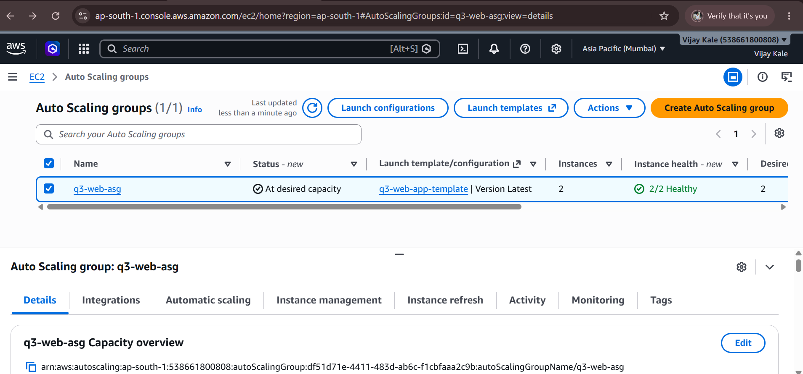
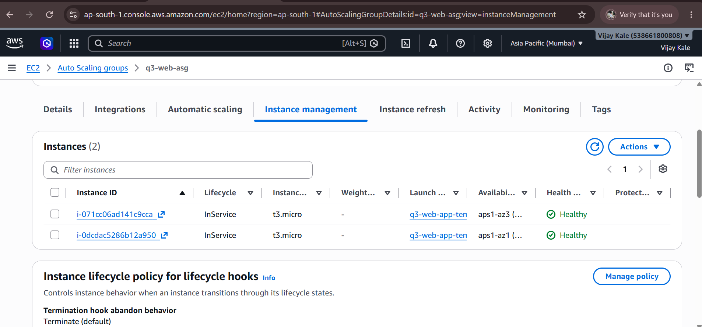
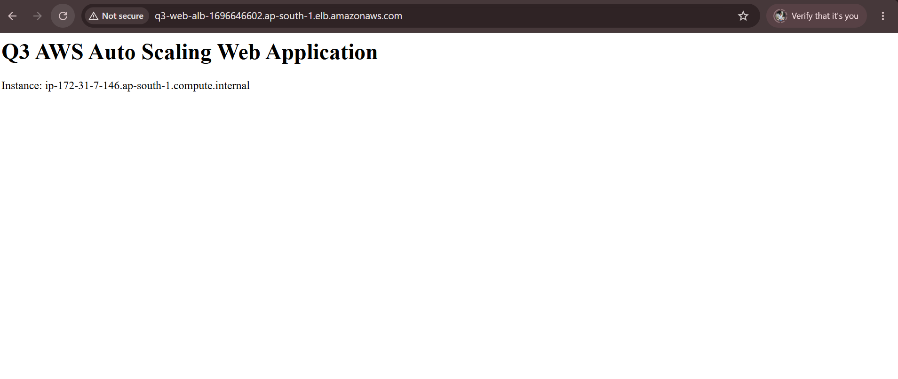

# Q3 – AWS High Availability Web Application

## Project Overview

This project demonstrates a highly available web application deployed on AWS using **Amazon EC2, Nginx, Application Load Balancer, Target Group, Launch Template, and Auto Scaling Group**.

The application is deployed across multiple Availability Zones. The Auto Scaling Group maintains two EC2 instances and automatically launches a replacement instance when an instance is terminated.

---

## AWS Architecture

```text
                         Internet
                            |
                            v
                Application Load Balancer
                       q3-web-alb
                            |
                            v
                   Target Group
                  q3-web-targets
                     /         \
                    /           \
                   v             v
              EC2 Instance   EC2 Instance
                  AZ-1           AZ-2
                    \             /
                     \           /
                    Auto Scaling
                       Group
```

---

## AWS Services Used

- Amazon EC2
- Application Load Balancer (ALB)
- Target Group
- Auto Scaling Group (ASG)
- Launch Template
- Amazon VPC
- Availability Zones
- Nginx
- Linux

---

# Setup

## 1. Configure EC2 Instance

An EC2 instance was launched and configured as the base web server.

Nginx was installed and started on the EC2 instance.

The following **User Data script** was used:

```bash
#!/bin/bash
dnf update -y
dnf install -y nginx
systemctl enable nginx
systemctl start nginx

echo "<h1>Q3 AWS Auto Scaling Web Application</h1>" > /usr/share/nginx/html/index.html
echo "<p>Instance: $(hostname)</p>" >> /usr/share/nginx/html/index.html
```

The script automatically installs and starts Nginx and creates the application web page.

The application was verified using the EC2 instance public IP address.

---

## 2. Create AMI

After configuring the EC2 instance and Nginx application, an **Amazon Machine Image (AMI)** was created.

The AMI was used as the base image for instances launched through the Auto Scaling Group.

---

## 3. Create Target Group

A Target Group was created with the following configuration:

```text
Name: q3-web-targets
Target Type: Instances
Protocol: HTTP
Port: 80
```

HTTP health checks were configured to verify whether the EC2 instances were available.

Expected health status:

```text
2/2 Healthy
```

---

## 4. Create Application Load Balancer

An Internet-facing Application Load Balancer was created.

```text
Name: q3-web-alb
Type: Application Load Balancer
Scheme: Internet-facing
Listener: HTTP : 80
```

The Target Group `q3-web-targets` was attached to the Load Balancer.

The ALB receives requests from the Internet and forwards them to healthy EC2 instances.

---

## 5. Create Launch Template

A Launch Template was created using the AMI created from the configured EC2 instance.

The Launch Template contains the required:

- AMI
- Instance type
- Key pair
- Security Group
- Instance configuration

The Launch Template was then used by the Auto Scaling Group.

---

## 6. Create Auto Scaling Group

An Auto Scaling Group was created using the Launch Template.

The configuration was:

```text
Minimum Capacity: 2
Desired Capacity: 2
```

The Auto Scaling Group was configured across multiple Availability Zones.

The Target Group `q3-web-targets` was attached to the Auto Scaling Group.

After creation, two EC2 instances were running.

---

## 7. Verify Target Group Health

The Target Group was checked to verify the health of both EC2 instances.

Final healthy status:

```text
2/2 Healthy
```

Both EC2 instances successfully passed the configured health checks.

---

## 8. Test Application Through ALB

The Application Load Balancer DNS name was copied and opened in a web browser.

```text
http://<ALB-DNS-NAME>
```

The application page successfully loaded through the ALB.

This confirmed the request flow:

```text
Internet
   ↓
Application Load Balancer
   ↓
Target Group
   ↓
EC2 Instance
   ↓
Nginx Web Application
```

---

# Failure and Recovery Test

To verify Auto Scaling, one running EC2 instance was manually terminated.

The Auto Scaling Group detected that the number of running instances had fallen below the desired capacity.

It automatically launched a replacement EC2 instance.

After the replacement instance passed the Target Group health check, the environment returned to:

```text
Auto Scaling Group: 2 Instances
Target Group: 2/2 Healthy
Application: Working
```

This verified the automatic instance replacement functionality of the Auto Scaling Group.

---

# Final Configuration

| Component | Configuration |
|---|---|
| Load Balancer | `q3-web-alb` |
| Target Group | `q3-web-targets` |
| Load Balancer Type | Application Load Balancer |
| Listener | HTTP : 80 |
| Target Type | EC2 Instances |
| Auto Scaling Minimum | 2 |
| Auto Scaling Desired | 2 |
| Healthy Targets | 2/2 |
| Web Server | Nginx |
| Deployment | Multiple Availability Zones |

---

# Final Result

The Q3 application was successfully deployed using AWS high-availability components.

The final setup successfully demonstrated:

- EC2 web server deployment
- Nginx web server configuration
- AMI creation
- Target Group configuration
- Application Load Balancer configuration
- Launch Template configuration
- Auto Scaling Group configuration
- Multi-AZ deployment
- Target health checks
- Automatic EC2 instance replacement
- Application access through ALB DNS

The failure test was successfully completed, and the environment returned to **2/2 healthy targets** after an EC2 instance was terminated.

---

# Screenshots


## 1. Target Group – 2/2 Healthy


## 2. Auto Scaling Group



## 3. Auto Scaling Instance Replacement



## 4. ALB Application Test




---

## Conclusion

The Q3 implementation successfully demonstrates a highly available AWS web application using **EC2, Nginx, Application Load Balancer, Target Group, Launch Template, and Auto Scaling Group**.

The successful failure test confirms that the Auto Scaling Group automatically replaced the terminated instance and restored the environment to **2/2 healthy targets**.
